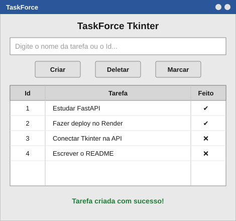

<h1 align="center">🖥️ TaskForce Tkinter</h1>

<p align="center">Aplicação <b>desktop</b> desenvolvida em <b>Python + Tkinter</b> para gerenciar tarefas (to-do list), consumindo a  <a href="https://github.com/GoomezCode/TaskForce_api">TaskForce API</a> através de requisições HTTP.</p>

<p align="center">
    
    
    
    
</p>

---

## 🖼️ Preview da tela

<p align="center"></p>

> Interface: campo de título + botão Criar, barra de busca/filtro, tabela (Id, Tarefa, Feito, Data, Hora) com seleção, botões Alternar feito/Editar/Deletar/Atualizar, paginação, resumo + barra de progresso no topo, mensagens de status no rodapé e alternância de tema Claro/Escuro no cabeçalho.

---

## 📌 Sobre o projeto

O **TaskForce Tkinter** é o cliente gráfico (front-end desktop) do projeto TaskForce. Ele não armazena nenhum dado localmente — toda a lógica de persistência acontece na **TaskForce API**, e esta aplicação apenas consome os endpoints via HTTP usando a biblioteca `requests`.

Funcionalidades:

- ✅ Criar novas tarefas
- ✅ Listar tarefas em tabela (Id, Tarefa, Feito, Data, Hora)
- ✅ Marcar/desmarcar tarefas como concluídas (botão ou duplo-clique)
- ✅ Editar o título de uma tarefa
- ✅ Deletar tarefas (com confirmação)
- ✅ Buscar por texto, filtrar (Todas/Pendentes/Concluídas) e paginar
- ✅ Resumo (total/feitas/pendentes via `GET /stats`) + barra de progresso
- ✅ Temas Claro/Escuro com botão no cabeçalho (persistido em `~/.config/taskforce/theme.json`)
- ✅ Feedback visual das operações + tratamento de API offline/timeout

---

## 🚀 Tecnologias utilizadas

- [Python 3](https://www.python.org/)
- [Tkinter](https://docs.python.org/3/library/tkinter.html) — biblioteca padrão do Python para GUI
- [ttk (Treeview)](https://docs.python.org/3/library/tkinter.ttk.html) — componente de tabela
- [Requests](https://requests.readthedocs.io/) — comunicação HTTP com a API

---

## 🔗 Projeto relacionado

Esta aplicação depende da API abaixo estar no ar para funcionar:

- 🔌 [TaskForce API](https://github.com/GoomezCode/TaskForce_api) — back-end em FastAPI responsável por criar, listar, marcar e deletar as tarefas.

---

## 📂 Estrutura do projeto

```
TaskForce_tkinter/
├── api/
│   ├── __init__.py
│   └── client.py           # TaskForceClient (Session, timeout, ApiError) — API v2
├── ui/
│   ├── __init__.py
│   ├── theme.py            # Tokens Claro/Escuro + persistência do tema
│   └── styles.py           # apply_theme() sobre ttk `clam`
├── util/
│   └── utilTask.py         # Shim de compatibilidade (deprecated, use api.client)
├── config.py               # TASKFORCE_API_URL/TIMEOUT/PAGE_SIZE/THEME (env + .env + fallback)
├── .env.example            # Exemplo de configuração
├── main.py                 # Interface gráfica (Tkinter/ttk) e lógica da aplicação
├── requirements.txt        # Dependências do projeto
└── README.md
```

> Compatível com a **TaskForce API v2.0.0** (`/api/v1/tasks` com corpos JSON
> `{"title": ...}`; respostas usam `tarefa`/`feito`/`data`/`hora`).

---

## ⚙️ Como executar o projeto

### 1. Clone o repositório

```bash
git clone https://github.com/GoomezCode/TaskForce_tkinter.git
cd TaskForce_tkinter
```

### 2. Crie e ative um ambiente virtual (opcional, mas recomendado)

```bash
python -m venv venv

# Windows
venv\Scripts\activate

# Linux/Mac
source venv/bin/activate
```

### 3. Instale as dependências

```bash
pip install -r requirements.txt
```

### 4. Configure a URL da API (opcional)

Por padrão o app já aponta para a produção. Só configure se for usar outra API
(ex: localhost). Ordem de resolução: **variável de ambiente → arquivo `.env` → produção**.

```bash
cp .env.example .env   # opcional; edite TASKFORCE_API_URL se necessário
```

| Variável | Default (produção) | Exemplo local |
|---|---|---|
| `TASKFORCE_API_URL` | `https://taskforce-api-zxag.onrender.com/api/v1/tasks` | `http://localhost:8000/api/v1/tasks` |
| `TASKFORCE_TIMEOUT` | `10` (segundos) | `15` |
| `TASKFORCE_PAGE_SIZE` | `20` | `50` |
| `TASKFORCE_THEME` | `light` (tema inicial) | `dark` |

> Pode colar só a raiz (`https://taskforce-api-zxag.onrender.com/`) que o app completa com `/api/v1/tasks` sozinho.

> ⚠️ Se a API estiver hospedada no plano gratuito do Render, o primeiro acesso após um período de inatividade pode demorar alguns segundos (cold start) — o app mostra "Carregando..." e não trava graças às requisições em thread separada.

### 5. Execute a aplicação

```bash
python main.py
```

Uma janela do Tkinter será aberta com a interface do TaskForce.

---

## 🕹️ Como usar

| Ação | Como fazer |
|---|---|
| **Criar tarefa** | Digite o título no campo superior e clique em **Criar** (ou `Enter`) |
| **Buscar/filtrar** | Digite no campo Buscar, escolha Todas/Pendentes/Concluídas e clique em **Buscar** |
| **Marcar como concluída** | Selecione a linha e clique em **Alternar feito** (ou duplo-clique) |
| **Editar título** | Selecione a linha e clique em **Editar** |
| **Deletar tarefa** | Selecione a linha e clique em **Deletar** (pede confirmação) |
| **Paginar** | Use **◀ Anterior / Próxima ▶** e o seletor de itens/página |
| **Trocar tema** | Clique em **Tema: Escuro/Claro** no canto superior direito |

A tabela é atualizada automaticamente após cada ação, e a mensagem na parte inferior da tela informa se a operação foi bem-sucedida ou se ocorreu algum erro.

---

## 🛠️ Melhorias futuras

- [x] Substituir o campo único de entrada por seleção na tabela + campo de título
- [x] Adicionar confirmação antes de deletar uma tarefa
- [x] Adicionar edição do texto de uma tarefa já criada
- [x] Melhorar o tratamento de erros de conexão com a API (timeout + thread + mensagem amigável)
- [x] Permitir configurar a URL da API por variável de ambiente/arquivo `.env`
- [x] Tema escuro persistido (alternância Claro/Escuro no cabeçalho)
- [ ] Diálogo de configurações dentro do app (trocar URL sem editar arquivo)
- [ ] Exportar tarefas para CSV
- [ ] Atalhos de teclado

---

## 👤 Autor

Desenvolvido por [**GoomezCode**](https://github.com/GoomezCode).